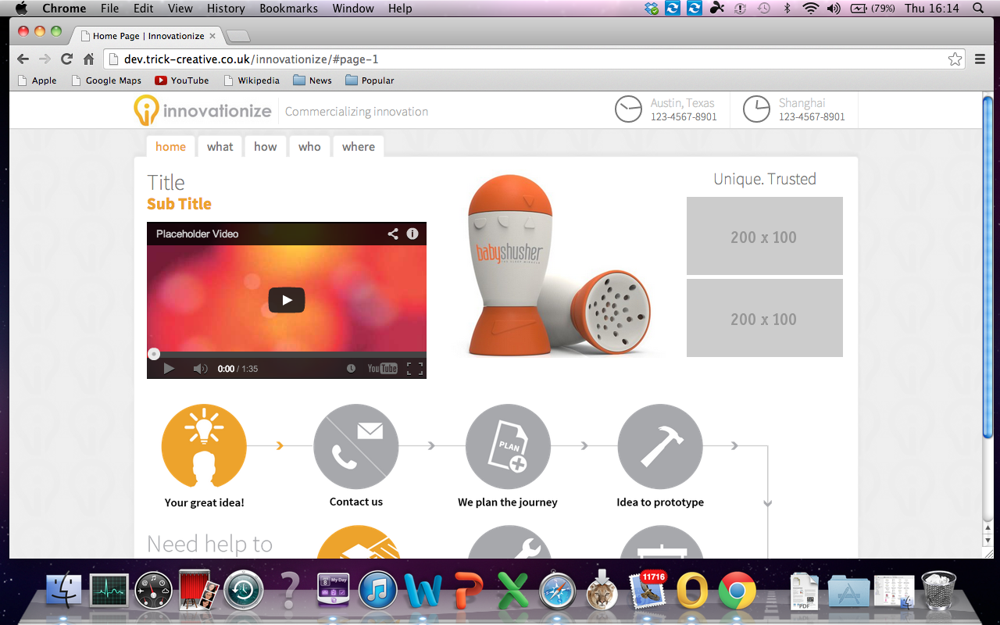

# Why Why GUI?

*Who really needs a GUI anyway?*

## Disclaimer

Note:
- GUI's are not inherently bad, just misused

### Pareto principle

<!-- .slide: data-background="pareto" -->

Note:
- 80 - 20 rule
- 80% of you will spend 80% time on a computer coding, browsing & in the terminal

<h3 class="personal-slant"> A Personal Slant</h3>

Note:
- This is from my personal perspective as mainly a web developer
- But hopefully will apply to most people

## What is a GUI?

### Graphical User Interface

Note:
- Covers many things from websites to card machines to phones to dwms

## Factors

Note:
- What is important

### Contextual

Note:
- In a perfect world everything gets out of the way
- What you need is there when you need it

### Productivity

Note:
- In general you are trying to get shit done

### Annoyance

Note:
- Ease of use
- Your GUI should not piss you off

### Immersion

Note:
- In certain scenarios GUIs can distract from what is truly going on
- Example show the exact same game but the immersion levels differ

<iframe class="stretch" width="960" height="540" src="http://www.youtube.com/embed/uLg68EgL4hM?enablejsapi=1&start=55&theme=light&showinfo=0&rel=0&modestbranding=1&controls=0" frameborder="0" allowfullscreen data-autoplay></iframe>

<iframe class="stretch" width="960" height="720" src="http://www.youtube.com/embed/0fWR0cq01Yk?enablejsapi=1&start=51&theme=light&showinfo=0&rel=0&modestbranding=1&controls=0" frameborder="0" allowfullscreen data-autoplay></iframe>

## Desktop window managers

Note:
- So many useless features

### Enough with the floating windows already

</img>
</img>
</img>

Note:
- What's the point?
- They just get in the way
- Window borders are useless. They take up valuable screen real estate for 3 functions.
- And resizing windows is totally inefficient
- It's not just windows...

### Everyone's worst nightmare

God
Damn
Pop
Ups

Note:
- Floating window managers are the worst for these!

### Space

    </img>
    
2.6%

    
8.6%

    
3.5%

    
10.7%

    
75.3%

Note:
- DWMs take up a lot of space
- This is an actual example of a client.

### Speed

Note:
- Clicking around is simply slower

### Weight

Note:
- They are bigger and more complex than other alternatives

### Touch Screen Devices

<!-- .slide: data-background="img/ios-android-windows.jpg" -->

Note:
- This was a chance to ditch traditional GUIs
- They ditched floating windows for a reason
- Things hidden away until needed

## The alternatives

### Half way houses
#### *Get out of the way a little more*
<h4 class="fragment">Windows 8</h4>
<h4 class="fragment">Gnome 3</h4>

Note:
- I know they still have windows but you can see the movement away from the ancient principals

### The full english
#### *Tiling window managers*
<h4 class="fragment">Keyboard driven</h4>
<h4 class="fragment">Highly configurable</h4>
<h4 class="fragment">Suitable for any hardware</h4>

Note:
- Any time away from the keyboard wastes time
- My window manger is completely customisable with a few hundred lines of code
- Super fast

### Not quite there yet
#### *What to expect in the future*
<h4 class="fragment">More contextual interfaces</h4>
<h4 class="fragment">Smarter voice control</h4>
<h4 class="fragment">Gestures everywhere</h4>
<h4 class="fragment">Brain control</h4>

Note:
- Some of this has already begun
- Info on what restaurants are nearby if it is an appropriate time
- Google will already give you your flight and hotel details when you are travelling on a holiday
- Voice control is fairly useful but can't yet perform complex tasks such as programming
- Gestures on touchsceens and 3d sensors are cool and get GUI out of the way but they need to be more standardised and don't offer much benefit over a keyboard for the majority of common tasks
- I think brain control is the final step. It's the only thing I can see being more efficient than any of the other options in every scenario.
- But that is a long way away, so what can you do now?

## Tips & tricks

### Learn your shortcuts

<h4 class="fragment">vim all the things</h4>

Note:
- Pretty much every thing has vim shortcuts
- cVim for chrome, Pentadactyl for firefox
- Most tiling window managers
- Even gmail shortcuts are based on vim

### Get a decent shell

<h4 class="fragment">zsh / fish</h4>

Note:
- They just make life easier with smart autocompletion and helpful extras
- Recommend oh-my-zsh and oh-my-fish for some nice defaults

### Automate

<h4 class="fragment">JavaScript task runners are pretty cool</h4>
<h4 class="fragment">Shell scripting is easier than you would think</h4>

Note:
- Task runners let you automate menial development tasks like concatenation or image optimisation

### Spend the time to customize

Note:
- All these thing require a decent bit of work
- But having everything exactly as you need it is worth it

<!-- .slide: data-background="img/thumbs-up.jpg" -->

Note:
## Thanks!

## Want a demo?

### Image Credits

- [Thumbs Up](https://flic.kr/p/9FK7xh)